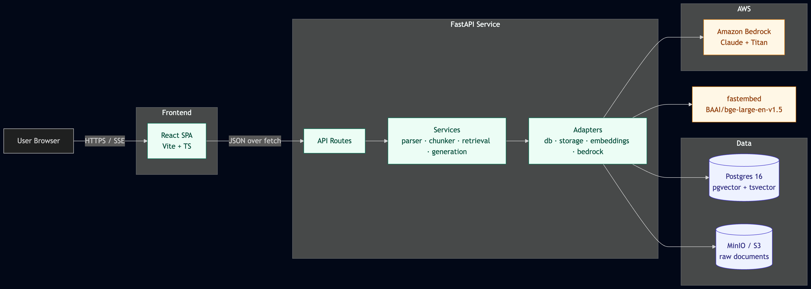

# Enterprise Knowledge Assistant

A retrieval-augmented question-answering system for internal documents. Upload PDFs, Word docs, or markdown; ask questions in natural language; get grounded answers with inline citations back to the source page.



## The problem

Internal documents — HR policies, security guidelines, runbooks, SOPs — live across SharePoint, Confluence, shared drives, and PDFs. People lose meaningful time every day searching for information that's already been written down. Generic LLMs can't see private content and hallucinate confidently when they don't know the answer.

This project closes that gap: documents stay inside a controlled environment, every answer is grounded in retrieved chunks, and every claim is traceable back to a specific source and page. When the system doesn't have the answer, it abstains explicitly instead of making something up.

## What it does

- Upload PDFs, DOCX, TXT, or Markdown documents through a web UI
- Async-style ingestion pipeline: parse, chunk (token-counted with overlap), embed, index
- Hybrid retrieval combining dense vector similarity (pgvector) and BM25-style keyword search (Postgres tsvector), fused via Reciprocal Rank Fusion
- Streaming chat with Server-Sent Events; tokens appear as the model generates them
- Inline numbered citations rendered as clickable chips, with a side panel showing source filename, page number, and a snippet
- Strict abstention behavior when retrieved context is insufficient
- A repeatable evaluation harness with 20 hand-written golden questions and measured metrics on faithfulness, citation correctness, and abstention precision

## Architecture

```
┌────────┐   HTTPS   ┌───────────┐   internal     ┌────────────┐
│ React  │──────────▶│  FastAPI  │───────────────▶│  Postgres  │
│  (SPA) │◀──── SSE──│   API     │                │ + pgvector │
└────────┘           └─────┬─────┘                └────────────┘
                           │
                           ├─▶ MinIO / S3   (raw document storage)
                           ├─▶ fastembed    (local embeddings, BAAI/bge-large-en-v1.5)
                           └─▶ Bedrock      (Claude Haiku/Sonnet, Titan Embeddings)
```

Three deployable surfaces: a React SPA, a FastAPI backend, and Postgres with the `pgvector` extension. Object storage is S3-compatible; locally that's MinIO, in production it's AWS S3. Embeddings can run locally on CPU via fastembed or remotely via Amazon Bedrock — one config flag picks which. The chat LLM is Anthropic Claude on Bedrock.

Detailed system, ingestion, and query diagrams in [docs/architecture.md](docs/architecture.md).

## Tech stack

| Layer            | Choices                                                                  |
|------------------|--------------------------------------------------------------------------|
| Frontend         | React 18, Vite, TypeScript, Tailwind, react-router-dom                   |
| Backend          | Python 3.12, FastAPI, Pydantic v2, structlog, SQLAlchemy 2 async         |
| Database         | Postgres 16 with `pgvector` and `tsvector` GIN indexing                  |
| Storage          | MinIO locally, AWS S3 in production (boto3 with `endpoint_url` swap)     |
| Embeddings       | `BAAI/bge-large-en-v1.5` via fastembed (local), or Titan v2 via Bedrock  |
| LLM              | Anthropic Claude Haiku 4.5 / Sonnet on Amazon Bedrock                    |
| Migrations       | Alembic, async-aware                                                     |
| Eval             | Custom harness with golden Q&A set                                       |
| Local dev        | Docker Compose                                                            |

## Quickstart

Prerequisites: Docker Desktop. AWS credentials with Bedrock model access for the chat features.

```bash
git clone <this-repo> enterprise-knowledge-assistant
cd enterprise-knowledge-assistant
cp .env.example .env
# Add AWS_ACCESS_KEY_ID and AWS_SECRET_ACCESS_KEY to .env

make up           # build images + start db, minio, api, frontend
make migrate      # apply database schema
```

Then open:

| Service        | URL                            |
|----------------|--------------------------------|
| Frontend       | <http://localhost:5173>        |
| API docs       | <http://localhost:8000/docs>   |
| MinIO console  | <http://localhost:9001>        |

Upload a document on the **Documents** page, then ask a question on the **Chat** page. Tokens stream in; citations populate the side panel.

A complete list of `make` commands is in the `Makefile` (`make help`).

## Sample workflow

```bash
# Seed the database with three sample policy documents
make eval-seed

# Smoke-test Bedrock connectivity end-to-end
make smoke

# Try a chat from the command line (bypasses the browser)
make chat-smoke Q="What is the PTO policy?"
```

## Evaluation

The system ships with a 20-question evaluation harness. Run:

```bash
make eval LABEL=baseline
```

The harness measures, on a fresh corpus of three sample documents:

| Metric                       | Result   |
|------------------------------|----------|
| Cited expected source        | 100.0%   |
| Avg keyword recall           | 97.8%    |
| Abstention precision         | 100.0%   |
| Latency p50 / p95            | 1.2s / 2.0s |

Methodology, comparison runs, and full per-question results are in [docs/evaluation.md](docs/evaluation.md) and `evals/reports/`.

## Project structure

```
backend/         FastAPI service + Alembic migrations
frontend/        React SPA
sample_docs/     Three corpus documents used by the eval harness
evals/           Golden Q&A set, eval runner, and reports
docs/            Architecture, design decisions, deployment, security, cost
infra/           (placeholder for Terraform — not part of this build)
scripts/         DB initialization
```

## Security and governance

- All ingested files stored in encrypted-at-rest object storage
- Per-user `owner_id` filtering on every retrieval query (foundation for multi-tenancy)
- Structured audit logs with request IDs propagated through the call stack
- Citation enforcement at the prompt level prevents ungrounded claims
- TLS expected at the API gateway in deployed environments

Threat model and detailed mitigations in [docs/security.md](docs/security.md).

## Cost

At local-dev scale this project costs nothing beyond electricity. With Bedrock enabled and Haiku 4.5 as the chat model, ~100 questions per day costs less than US $1/month. Detailed breakdown in [docs/cost.md](docs/cost.md).

## Limitations

- DOCX page numbers collapse to "page 1" — `.docx` is a paragraph-flow format and doesn't have reliable page coordinates without rendering
- Scanned/image PDFs aren't OCR'd in the current pipeline; pypdf returns empty text for image-only pages
- No authentication yet — the API uses a single `local-user` identity. Auth scaffolding via Cognito or Auth0 is the next step
- Async ingestion in the current build is synchronous-from-the-API-perspective; the architectural shape for S3 → SQS → Lambda is documented in [docs/architecture.md](docs/architecture.md) but not deployed
- Eval corpus is three documents; results don't generalize to large multi-thousand-document corpora without re-running the harness

## License

MIT — see [LICENSE](LICENSE).
